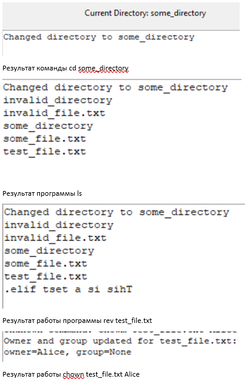
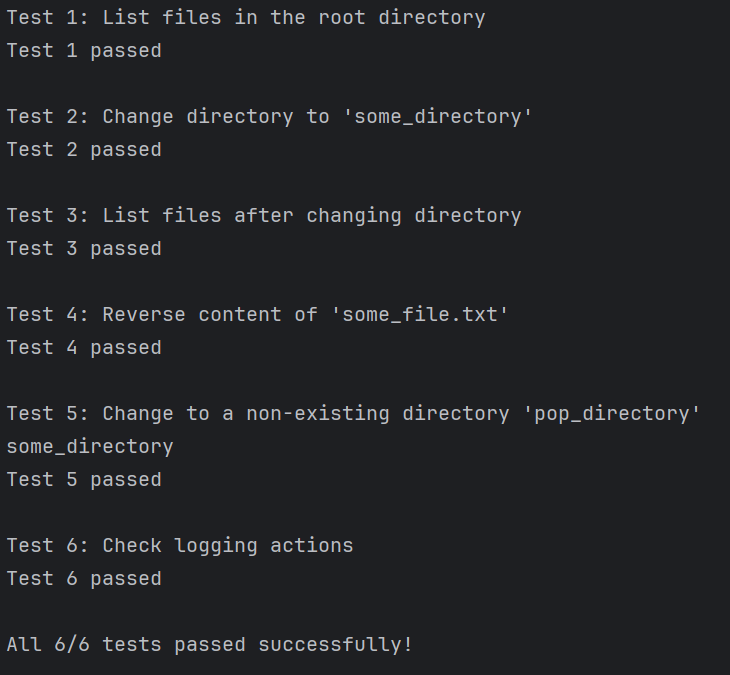

# Shell Emulator

## Описание

Проект реализует эмулятор оболочки, предоставляющий функционал для работы с виртуальной файловой системой, основанной на `tar`-архиве. Эмулятор поддерживает команды для навигации, управления файлами и ведения истории операций. Также имеется графический интерфейс для удобного взаимодействия.

## Структура файлов

Проект состоит из следующих компонентов:

- `shell_emulator.py`: Основная реализация эмулятора оболочки.
- `test_shell_emulator.py`: Тесты для проверки функциональности эмулятора.
- `config.csv`: Файл конфигурации, содержащий пути к архиву файловой системы и другим параметрам.
- `log_file.csv`: Файл логирования, содержащий логи программы.


## Функциональность

Эмулятор поддерживает следующие команды:

- **`ls`**: Список файлов и директорий в текущей директории.
- **`cd <путь>`**: Изменение текущей рабочей директории.
- **`rev <файл>`**: Обратный вывод содержимого файла.
- **`chown <файл> <владелец>`**: Изменение владельца и группы файла.
- **`exit`**: Выход из эмулятора.

## Описание классов

### Shell_emulator

Основной класс, реализующий функциональность эмулятора.

#### Основные методы:

- **`__init__(self, config_path)`**: Инициализация эмулятора с конфигурационным файлом.
- **`load_config(self, config_path)`**: Загрузка параметров конфигурации.
- **`load_virtual_fs_tar(self)`**: Загрузка файловой системы из `tar`-архива.
- **`cd(self, path)`**: Изменение текущей директории.
- **`ls(self)`**: Вывод содержимого текущей директории.
- **`rev(self, file)`**: Обратный вывод содержимого файла.
- **`chown(self, file_name, owner, group=None)`**: Изменение владельца и группы файла.
- **`log_action(self, action_type, details, user=0)`**: Логирование действий.

### ShellGUI

Класс для реализации графического интерфейса с использованием `tkinter`.

#### Основные элементы интерфейса:

- Поле отображения текущей директории.
- Область вывода текста.
- Поле ввода команд.

## Запуск проекта

### Предварительные требования

Убедитесь, что у вас установлен Python 3.x и библиотеки:

- `os`
- `tarfile`
- `csv`
- `tkinter`

### Запуск эмулятора

Для запуска графического интерфейса выполните:

```bash
python shell_emulator.py
```

#### Результаты ввода команд пользователем:


#### Результаты тестирования:

